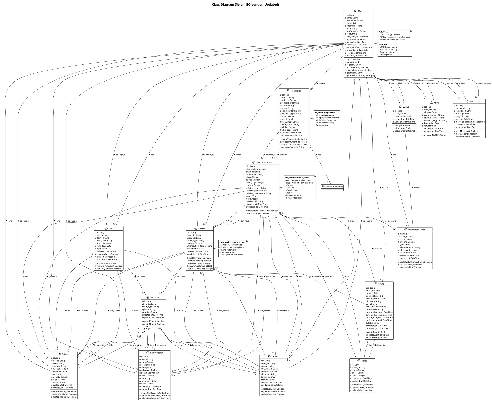

# Class Diagram Sistem Informasi EO-Vendor (Updated Based on Actual Database)

```plantuml
@startuml
!theme plain
title Class Diagram Sistem EO-Vendor (Updated)

class User {
  - id: Long
  - name: String
  - username: String
  - email: String
  - password: String
  - uuid: String
  - profile_photo: String
  - role: String
  - last_seen_at: DateTime
  - is_banned: Boolean
  - banned_at: DateTime
  - banned_reason: String
  - email_verified_at: DateTime
  - remember_token: String
  - created_at: DateTime
  - updated_at: DateTime
  --
  + login(): Boolean
  + logout(): void
  + register(): Boolean
  + updateProfile(): Boolean
  + changePassword(): Boolean
  + getInitials(): String
  + getProfilePhotoUrl(): String
}

class Mitra {
  - id: Long
  - user_id: Long
  - address: String
  - npwp_number: String
  - npwp_file_path: String
  - business_file_path: String
  - description: Text
  - status: String
  - created_at: DateTime
  - updated_at: DateTime
  --
  + getNpwpFileUrl(): String
}

class Event {
  - id: Long
  - user_id: Long
  - name: String
  - description: Text
  - event_mode: String
  - location: String
  - pin: String
  - link_meeting: String
  - thumbnail: String
  - event_date_start: DateTime
  - event_date_end: DateTime
  - ticket_date_start: DateTime
  - ticket_date_end: DateTime
  - status: String
  - created_at: DateTime
  - updated_at: DateTime
  --
  + createEvent(): Boolean
  + updateEvent(): Boolean
  + cancelEvent(): Boolean
}

class Transaction {
  - id: Long
  - user_id: Long
  - order_id: String
  - redirect_url: String
  - status: String
  - token: String
  - expired_at: DateTime
  - payment_type: String
  - total: Decimal
  - tax: Decimal
  - va_number: String
  - bank_name: String
  - bill_key: String
  - biller_code: String
  - created_at: DateTime
  - updated_at: DateTime
  --
  + createTransaction(): Boolean
  + processPayment(): Boolean
  + cancelTransaction(): Boolean
  + generateInvoice(): String
}

class Wallet {
  - id: Long
  - user_id: Long
  - balance: Decimal
  - created_at: DateTime
  - updated_at: DateTime
  --
  + topUp(): Boolean
  + withdraw(): Boolean
  + getBalance(): Decimal
}

class Service {
  - id: Long
  - user_id: Long
  - name: String
  - thumbnail: String
  - description: Text
  - location: String
  - price: Decimal
  - status: String
  - created_at: DateTime
  - updated_at: DateTime
  --
  + createService(): Boolean
  + updateService(): Boolean
  + deleteService(): Boolean
}

class Building {
  - id: Long
  - user_id: Long
  - name: String
  - location: String
  - description: Text
  - thumbnail: String
  - pin: String
  - capacity: Integer
  - price: Decimal
  - status: String
  - created_at: DateTime
  - updated_at: DateTime
  --
  + createBuilding(): Boolean
  + updateBuilding(): Boolean
  + deleteBuilding(): Boolean
}

class RentProperty {
  - id: Long
  - user_id: Long
  - name: String
  - location: String
  - description: Text
  - delivered: Boolean
  - picked_up: Boolean
  - price: Decimal
  - pin: String
  - thumbnail: String
  - status: String
  - created_at: DateTime
  - updated_at: DateTime
  --
  + createRentProperty(): Boolean
  + updateRentProperty(): Boolean
  + deleteRentProperty(): Boolean
}

class TransactionItem {
  - id: Long
  - transaction_id: Long
  - item_id: Long
  - item_type: String
  - type: String
  - price: Integer
  - rent_days: Integer
  - status: String
  - delivery_type: String
  - delivery_fee: Decimal
  - delivery_fee_status: String
  - note: Text
  - qty: Integer
  - reviews_id: Long
  - created_at: DateTime
  - updated_at: DateTime
  --
  + createTransactionItem(): Boolean
  + updateStatus(): Boolean
}

class Ticket {
  - id: Long
  - event_id: Long
  - name: String
  - price: Decimal
  - quota: Integer
  - created_at: DateTime
  - updated_at: DateTime
  --
  + createTicket(): Boolean
  + updateTicket(): Boolean
  + deleteTicket(): Boolean
}

class Review {
  - id: Long
  - user_id: Long
  - item_id: Long
  - item_type: String
  - rating: Integer
  - transaction_item_id: Long
  - comment: Text
  - created_at: DateTime
  - updated_at: DateTime
  --
  + createReview(): Boolean
  + updateReview(): Boolean
  + deleteReview(): Boolean
  + getAverageRating(): Float
  + getTotalReviews(): Integer
}

class WalletTransaction {
  - id: Long
  - wallet_id: Long
  - user_id: Long
  - amount: Decimal
  - type: String
  - reference_type: String
  - reference_id: Long
  - description: String
  - created_at: DateTime
  - updated_at: DateTime
  --
  + createWalletTransaction(): Boolean
  + processCredit(): Boolean
  + processDebit(): Boolean
}

class Cart {
  - id: Long
  - user_id: Long
  - item_id: Long
  - item_type: String
  - item_qty: Integer
  - rent_days: Date
  - type: String
  - delivery_type: String
  - is_unavailable: Boolean
  - created_at: DateTime
  - updated_at: DateTime
  --
  + addToCart(): Boolean
  + removeFromCart(): Boolean
  + updateQuantity(): Boolean
}

class Chat {
  - id: Long
  - sender_id: Long
  - receiver_id: Long
  - message: Text
  - reply_id: Long
  - seen_at: DateTime
  - message_deleted_at: DateTime
  - created_at: DateTime
  - updated_at: DateTime
  --
  + sendMessage(): Boolean
  + markAsSeen(): Boolean
  + deleteMessage(): Boolean
}

class ItemPhoto {
  - id: Long
  - item_id: Long
  - item_type: String
  - photo: String
  - caption: String
  - created_at: DateTime
  - updated_at: DateTime
  --
  + uploadPhoto(): Boolean
  + deletePhoto(): Boolean
}

' Relasi antar kelas dengan cardinality
User "1" -- "0..1" Mitra : extends >
User "1" -- "0..*" Event : creates >
User "1" -- "0..*" Service : provides >
User "1" -- "0..*" Building : owns >
User "1" -- "0..*" RentProperty : owns >
User "1" -- "0..*" Transaction : makes >
User "1" -- "1" Wallet : has >
User "1" -- "0..*" Cart : has >
User "1" -- "0..*" Chat : sends/receives >
User "1" -- "0..*" Review : writes >
User "1" -- "0..*" WalletTransaction : has >

Mitra "1" -- "1" User : belongs_to >

Event "1" -- "0..*" Ticket : has >
Event "1" -- "0..*" TransactionItem : generates >

Transaction "1" -- "0..*" TransactionItem : contains >
Transaction "1" -- "0..1" TransactionAddress : has >

TransactionItem "1" -- "1" Transaction : belongs_to >
TransactionItem "1" -- "0..1" Review : can_have >
TransactionItem "1" -- "0..*" WalletTransaction : can_generate >

Ticket "1" -- "1" Event : belongs_to >
Ticket "1" -- "0..*" TransactionItem : generates >

Review "1" -- "1" User : written_by >
Review "1" -- "1" TransactionItem : for >
Review "1" -- "0..*" ItemPhoto : can_have >

Service "1" -- "1" User : belongs_to >
Service "1" -- "0..*" ItemPhoto : has >
Service "1" -- "0..*" TransactionItem : generates >
Service "1" -- "0..*" Review : can_receive >

Building "1" -- "1" User : belongs_to >
Building "1" -- "0..*" ItemPhoto : has >
Building "1" -- "0..*" TransactionItem : generates >
Building "1" -- "0..*" Review : can_receive >

RentProperty "1" -- "1" User : belongs_to >
RentProperty "1" -- "0..*" ItemPhoto : has >
RentProperty "1" -- "0..*" TransactionItem : generates >
RentProperty "1" -- "0..*" Review : can_receive >

Wallet "1" -- "1" User : belongs_to >
Wallet "1" -- "0..*" WalletTransaction : contains >

Cart "1" -- "1" User : belongs_to >
Cart "1" -- "0..*" ItemPhoto : can_have >

Chat "1" -- "1" User : sender >
Chat "1" -- "1" User : receiver >

ItemPhoto "1" -- "0..*" Service : belongs_to >
ItemPhoto "1" -- "0..*" Building : belongs_to >
ItemPhoto "1" -- "0..*" RentProperty : belongs_to >

' Polymorphic relationships
TransactionItem "1" -- "0..*" Service : item >
TransactionItem "1" -- "0..*" Building : item >
TransactionItem "1" -- "0..*" RentProperty : item >
TransactionItem "1" -- "0..*" Ticket : item >

Review "1" -- "0..*" Service : reviewable >
Review "1" -- "0..*" Building : reviewable >
Review "1" -- "0..*" RentProperty : reviewable >
Review "1" -- "0..*" Event : reviewable >

Cart "1" -- "0..*" Service : item >
Cart "1" -- "0..*" Building : item >
Cart "1" -- "0..*" RentProperty : item >

ItemPhoto "1" -- "0..*" Service : item >
ItemPhoto "1" -- "0..*" Building : item >
ItemPhoto "1" -- "0..*" RentProperty : item >

note right of User
  **Role Types:**
  - USER: Pelanggan biasa
  - MITRA: Penyedia layanan (Vendor)
  - ADMIN: Administrator sistem

  **Features:**
  - UUID-based routing
  - Search functionality
  - Banning system
  - Profile photos
end note

note right of Transaction
  **Payment Integration:**
  - Midtrans integration
  - Multiple payment methods
  - VA, E-Wallet, CC support
  - Token-based security
  - Order tracking
end note

note right of Review
  **Polymorphic Review System:**
  - Can review any item type
  - Linked to transaction items
  - Rating system (1-5)
  - Comment support
  - Average rating calculation
end note

note right of TransactionItem
  **Polymorphic Item System:**
  - Can reference any item type
  - Support for different item types:
    - Service
    - Building
    - RentProperty
    - Ticket
  - Delivery tracking
  - Review integration
end note

@enduml
```
