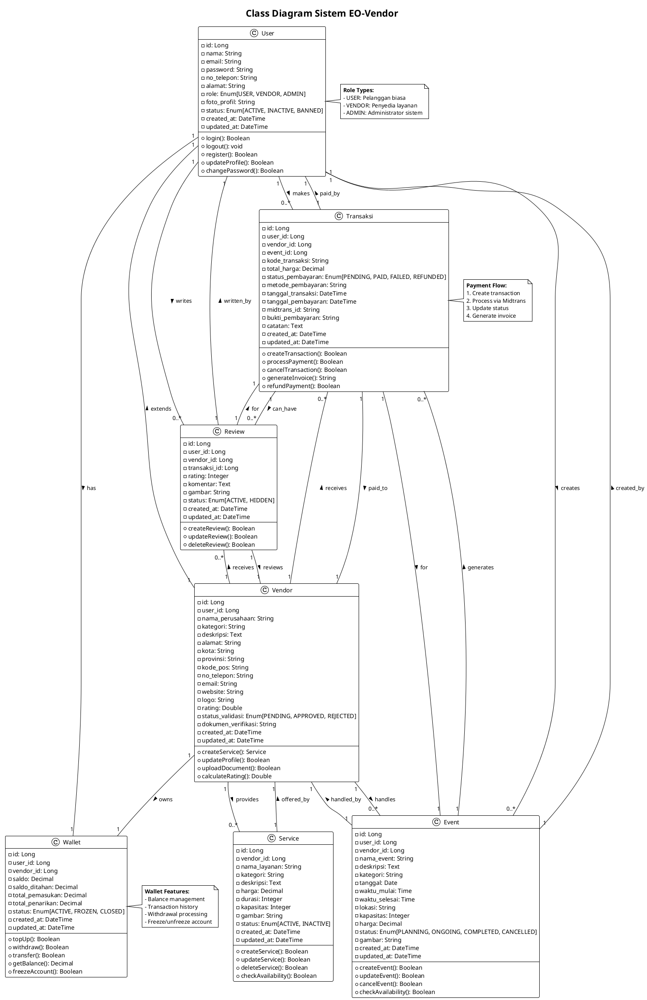

# Class Diagram Sistem Informasi EO-Vendor

```plantuml
@startuml
!theme plain
title Class Diagram Sistem EO-Vendor

class User {
  - id: Long
  - nama: String
  - email: String
  - password: String
  - no_telepon: String
  - alamat: String
  - role: Enum[USER, VENDOR, ADMIN]
  - foto_profil: String
  - status: Enum[ACTIVE, INACTIVE, BANNED]
  - created_at: DateTime
  - updated_at: DateTime
  --
  + login(): Boolean
  + logout(): void
  + register(): Boolean
  + updateProfile(): Boolean
  + changePassword(): Boolean
}

class Vendor {
  - id: Long
  - user_id: Long
  - nama_perusahaan: String
  - kategori: String
  - deskripsi: Text
  - alamat: String
  - kota: String
  - provinsi: String
  - kode_pos: String
  - no_telepon: String
  - email: String
  - website: String
  - logo: String
  - rating: Double
  - status_validasi: Enum[PENDING, APPROVED, REJECTED]
  - dokumen_verifikasi: String
  - created_at: DateTime
  - updated_at: DateTime
  --
  + createService(): Service
  + updateProfile(): Boolean
  + uploadDocument(): Boolean
  + calculateRating(): Double
}

class Event {
  - id: Long
  - user_id: Long
  - vendor_id: Long
  - nama_event: String
  - deskripsi: Text
  - kategori: String
  - tanggal: Date
  - waktu_mulai: Time
  - waktu_selesai: Time
  - lokasi: String
  - kapasitas: Integer
  - harga: Decimal
  - status: Enum[PLANNING, ONGOING, COMPLETED, CANCELLED]
  - gambar: String
  - created_at: DateTime
  - updated_at: DateTime
  --
  + createEvent(): Boolean
  + updateEvent(): Boolean
  + cancelEvent(): Boolean
  + checkAvailability(): Boolean
}

class Transaksi {
  - id: Long
  - user_id: Long
  - vendor_id: Long
  - event_id: Long
  - kode_transaksi: String
  - total_harga: Decimal
  - status_pembayaran: Enum[PENDING, PAID, FAILED, REFUNDED]
  - metode_pembayaran: String
  - tanggal_transaksi: DateTime
  - tanggal_pembayaran: DateTime
  - midtrans_id: String
  - bukti_pembayaran: String
  - catatan: Text
  - created_at: DateTime
  - updated_at: DateTime
  --
  + createTransaction(): Boolean
  + processPayment(): Boolean
  + cancelTransaction(): Boolean
  + generateInvoice(): String
  + refundPayment(): Boolean
}

class Wallet {
  - id: Long
  - user_id: Long
  - vendor_id: Long
  - saldo: Decimal
  - saldo_ditahan: Decimal
  - total_pemasukan: Decimal
  - total_penarikan: Decimal
  - status: Enum[ACTIVE, FROZEN, CLOSED]
  - created_at: DateTime
  - updated_at: DateTime
  --
  + topUp(): Boolean
  + withdraw(): Boolean
  + transfer(): Boolean
  + getBalance(): Decimal
  + freezeAccount(): Boolean
}

class Service {
  - id: Long
  - vendor_id: Long
  - nama_layanan: String
  - kategori: String
  - deskripsi: Text
  - harga: Decimal
  - durasi: Integer
  - kapasitas: Integer
  - gambar: String
  - status: Enum[ACTIVE, INACTIVE]
  - created_at: DateTime
  - updated_at: DateTime
  --
  + createService(): Boolean
  + updateService(): Boolean
  + deleteService(): Boolean
  + checkAvailability(): Boolean
}

class Review {
  - id: Long
  - user_id: Long
  - vendor_id: Long
  - transaksi_id: Long
  - rating: Integer
  - komentar: Text
  - gambar: String
  - status: Enum[ACTIVE, HIDDEN]
  - created_at: DateTime
  - updated_at: DateTime
  --
  + createReview(): Boolean
  + updateReview(): Boolean
  + deleteReview(): Boolean
}

' Relasi antar kelas dengan cardinality
User "1" -- "1" Wallet : has >
User "1" -- "0..*" Transaksi : makes >
User "1" -- "0..*" Event : creates >
User "1" -- "0..*" Review : writes >

Vendor "1" -- "1" User : extends >
Vendor "1" -- "0..*" Service : provides >
Vendor "1" -- "0..*" Event : handles >
Vendor "1" -- "0..*" Transaksi : receives >
Vendor "1" -- "1" Wallet : owns >
Vendor "1" -- "0..*" Review : receives >

Event "1" -- "1" User : created_by >
Event "1" -- "1" Vendor : handled_by >
Event "1" -- "0..*" Transaksi : generates >

Transaksi "1" -- "1" User : paid_by >
Transaksi "1" -- "1" Vendor : paid_to >
Transaksi "1" -- "1" Event : for >
Transaksi "1" -- "0..*" Review : can_have >

Review "1" -- "1" User : written_by >
Review "1" -- "1" Vendor : reviews >
Review "1" -- "1" Transaksi : for >

Service "1" -- "1" Vendor : offered_by >

note right of User
  **Role Types:**
  - USER: Pelanggan biasa
  - VENDOR: Penyedia layanan
  - ADMIN: Administrator sistem
end note

note right of Transaksi
  **Payment Flow:**
  1. Create transaction
  2. Process via Midtrans
  3. Update status
  4. Generate invoice
end note

note right of Wallet
  **Wallet Features:**
  - Balance management
  - Transaction history
  - Withdrawal processing
  - Freeze/unfreeze account
end note

@enduml
```
