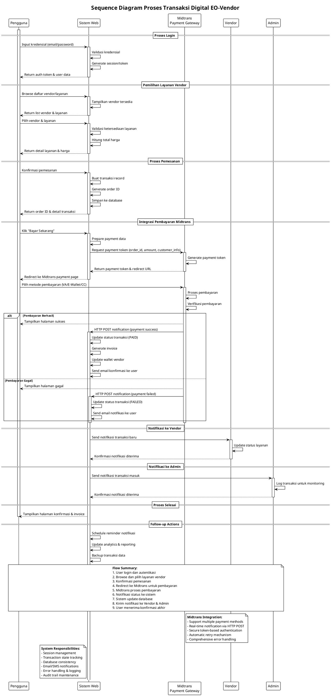

# Sequence Diagram Proses Transaksi Digital EO-Vendor

```plantuml
@startuml
!theme plain
title Sequence Diagram Proses Transaksi Digital EO-Vendor

participant "Pengguna" as User
participant "Sistem Web" as System
participant "Midtrans\nPayment Gateway" as Midtrans
participant "Vendor" as Vendor
participant "Admin" as Admin

== Proses Login ==
activate User
User -> System: Input kredensial (email/password)
activate System
System -> System: Validasi kredensial
System -> System: Generate session/token
System --> User: Return auth token & user data
deactivate System

== Pemilihan Layanan Vendor ==
User -> System: Browse daftar vendor/layanan
activate System
System -> System: Tampilkan vendor tersedia
System --> User: Return list vendor & layanan
deactivate System

User -> System: Pilih vendor & layanan
activate System
System -> System: Validasi ketersediaan layanan
System -> System: Hitung total harga
System --> User: Return detail layanan & harga
deactivate System

== Proses Pemesanan ==
User -> System: Konfirmasi pemesanan
activate System
System -> System: Buat transaksi record
System -> System: Generate order ID
System -> System: Simpan ke database
System --> User: Return order ID & detail transaksi
deactivate System

== Integrasi Pembayaran Midtrans ==
User -> System: Klik "Bayar Sekarang"
activate System
System -> System: Prepare payment data
System -> Midtrans: Request payment token (order_id, amount, customer_info)
activate Midtrans
Midtrans -> Midtrans: Generate payment token
Midtrans --> System: Return payment token & redirect URL
deactivate Midtrans

System --> User: Redirect ke Midtrans payment page
deactivate System

User -> Midtrans: Pilih metode pembayaran (VA/E-Wallet/CC)
activate Midtrans
Midtrans -> Midtrans: Proses pembayaran
Midtrans -> Midtrans: Verifikasi pembayaran

alt Pembayaran Berhasil
    Midtrans --> User: Tampilkan halaman sukses
    Midtrans -> System: HTTP POST notification (payment success)
    activate System
    System -> System: Update status transaksi (PAID)
    System -> System: Generate invoice
    System -> System: Update wallet vendor
    System -> System: Send email konfirmasi ke user
else Pembayaran Gagal
    Midtrans --> User: Tampilkan halaman gagal
    Midtrans -> System: HTTP POST notification (payment failed)
    activate System
    System -> System: Update status transaksi (FAILED)
    System -> System: Send email notifikasi ke user
end
deactivate System
deactivate Midtrans

== Notifikasi ke Vendor ==
System -> Vendor: Send notifikasi transaksi baru
activate Vendor
Vendor -> Vendor: Update status layanan
Vendor --> System: Konfirmasi notifikasi diterima
deactivate Vendor

== Notifikasi ke Admin ==
System -> Admin: Send notifikasi transaksi masuk
activate Admin
Admin -> Admin: Log transaksi untuk monitoring
Admin --> System: Konfirmasi notifikasi diterima
deactivate Admin

== Proses Selesai ==
System --> User: Tampilkan halaman konfirmasi & invoice
deactivate User

== Follow-up Actions ==
System -> System: Schedule reminder notifikasi
System -> System: Update analytics & reporting
System -> System: Backup transaksi data

note over User, Admin
  **Flow Summary:**
  1. User login dan autentikasi
  2. Browse dan pilih layanan vendor
  3. Konfirmasi pemesanan
  4. Redirect ke Midtrans untuk pembayaran
  5. Midtrans proses pembayaran
  6. Notifikasi status ke sistem
  7. Sistem update database
  8. Kirim notifikasi ke Vendor & Admin
  9. User menerima konfirmasi akhir
end note

note right of Midtrans
  **Midtrans Integration:**
  - Support multiple payment methods
  - Real-time notification via HTTP POST
  - Secure token-based authentication
  - Automatic retry mechanism
  - Comprehensive error handling
end note

note left of System
  **System Responsibilities:**
  - Session management
  - Transaction state tracking
  - Database consistency
  - Email/SMS notifications
  - Error handling & logging
  - Audit trail maintenance
end note

@enduml
```
